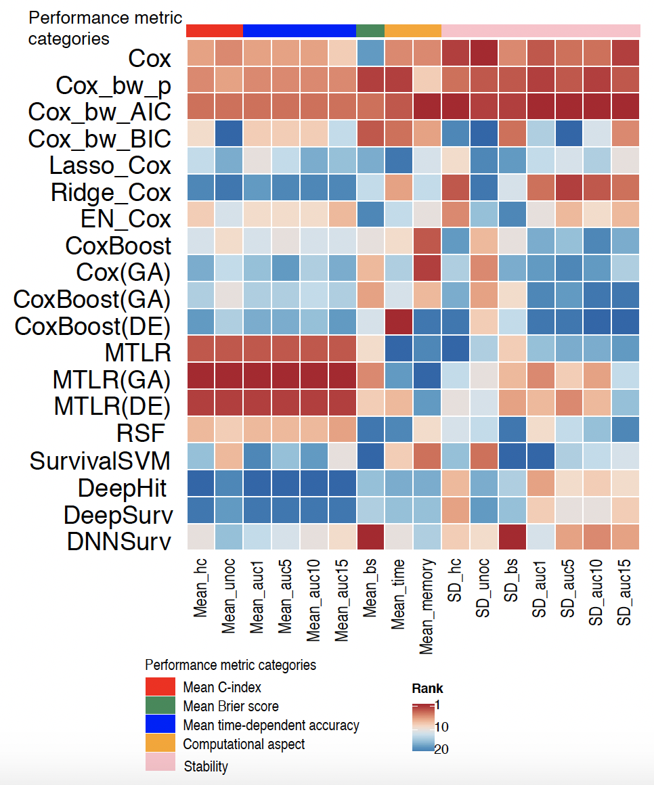

# SurvBenchmark: comprehensive benchmarking study of survival analysis methods using both omics data and clinical data


This is the work for SurvBenchmark (202205 updated) and the associated paper can be found: Zhang, Yunwei & Wong, Germaine & Mann, Graham & Muller, Samuel & Yang, Jean. (2021). SurvBenchmark: comprehensive benchmarking study of survival analysis methods using both omics data and clinical data. 10.1101/2021.07.11.451967. 

# Introduction 
We develop a benchmarking design, SurvBenchmark, that evaluates a diverse collection of survival models for both clinical and omics datasets. SurvBenchmark not only focuses on classical approaches such as the Cox model, but it also evaluates state-of-art machine learning survival models. 
There are 16 datasets (https://github.com/SydneyBioX/SurvBenchmark/blob/main/tables/table1.docx) 

**Table1.** Datasets summary

| **Dataset (name used in this paper)** | **Number of observations** | **No. of variables** | **Type of data** | **Censoring rate(rounded to 4 decimalplaces)**|**Reference** |
| --- | --- | --- | --- | --- |--- |
| Melanoma\_itraq | 41 | 643 | Omics | 0.4146 | Mactier, Swetlana et al. “Protein signatures correspond to survival outcomes of AJCC stage III melanoma patients.” Pigment cell & melanoma research vol. 27,6 (2014): 1106-16. doi:10.1111/pcmr.12290|
| Melanoma\_nano | 45 | 207 | Omics | 0.4222 | Wang,K.Y.X. et al. Cross-Platform Omics Prediction procedure: agame changer for implementing precision medicine in patientswithstage-IIImelanoma.bioRxiv2020.12.09.415927;doi:[https://doi.org/10.1101/2020.12.09.415927](https://doi.org/10.1101/2020.12.09.415927) |
| Ovarian\_2 | 58 | 19818 | Omics | 0.3793 | Ganzfried,B.F.etal.(2013)curatedOvarianData:clinicallyannotateddatafortheovariancancertranscriptome.Database,2013. |
| GE\_5 | 78 | 4753 | Omics | 0.5641 | van&#39;tVeer,L.J.etal.(2002)Geneexpressionprofilingpredictsclinical outcomeofbreast cancer.Nature,415,530–536. |
| GE\_3 | 86 | 6288 | Omics | 0.7209 | Bullinger,L.etal.(2004)UseofGene-ExpressionProfilingtoIdentifyPrognostic Subclasses in Adult Acute Myeloid Leukemia. NewEnglandJournalofMedicine,350, 1605–1616. |
| Melanoma\_clinical | 77 | 16 | Clinical | 0.3939 | Wang,K.Y.X. et al. Cross-Platform Omics Prediction procedure: agame changer for implementing precision medicine in patientswithstage-IIImelanoma.bioRxiv2020.12.09.415927;doi:[https://doi.org/10.1101/2020.12.09.415927.](https://doi.org/10.1101/2020.12.09.415927) |
| GE\_1 | 115 | 551 | Omics | 0.6670 | Sorlie,T. et al. (2003) Repeated observation of breast tumor subtypesin independent gene expression data sets. Proc. Natl. Acad. Sci.U.S. A., 100, 8418–8423. |
| GE-\_4 | 116 | 6285 | Omics | 0.5641 | van de Vijver,M.J. et al. (2002) A gene-expression signature as apredictorofsurvivalinbreastcancer.N.Engl.J.Med.,347,1999–2009. |
| Veteran | 137 | 8 | Clinical | 0.0657 | Kalbfleisch,J.D.andPrentice,R.L.(2002)TheStatisticalAnalysisofFailureTimeData.WileySeriesinProbabilityandStatistics. |
| Ovarian\_1 | 194 | 16050 | Omics | 0.7062 | Ganzfried,B.F.etal.(2013)curatedOvarianData:clinicallyannotateddatafortheovariancancertranscriptome.Database,2013. |
| Lung | 228 | 9 | Clinical | 0.2763 | Loprinzi,C.L.etal.(1994)Prospectiveevaluationofprognosticvariables from patient-completed questionnaires. North CentralCancerTreatment Group.J. Clin.Oncol., 12,601–607. |
| GE\_6 | 240 | 7401 | Omics | 0.4250 | Van Houwelingen,H.C. (2004) The Elements of Statistical Learning,Data Mining, Inference, and Prediction. Trevor Hastie, RobertTibshirani and Jerome Friedman, Springer, New York, 2001. No.of pages: xvi 533. ISBN 0-387-95284-5. Statistics in Medicine,23, 528–529. |
| GE\_2 | 295 | 4921 | Omics | 0.7322 | Beer,D.G.etal.(2002)Gene-expressionprofilespredictsurvivalofpatientswithlungadenocarcinoma.Nat.Med.,8,816–824. |
| PBC | 312 | 7 | Clinical | 0.5994 | Fleming,T.R.andHarrington,D.P.(2005)CountingProcessesandSurvivalAnalysis.WileySeriesinProbabilityandStatistics. |
| UNOS\_Kidney | 3000 | 101 | Clinical | 0.7350 | OPTNdata (https://optn.transplant.hrsa.gov/) |
| ANZ | 3323 | 40 | Clinical | 0.8739 | ANZDATA (https://www.anzdata.org.au/) |

and 20 survival methods (https://github.com/SydneyBioX/SurvBenchmark/blob/main/tables/table2.docx)

**Table2.** Summary of methods used in this study

| **Method name** | **Method name in this paper** | **R function name** | **R package name** | **Parameters (default)** |
| --- | --- | --- | --- | --- |
| Cox | Cox | coxph | survival | NA |
| Cox with backward elimination using AIC | Cox\_bw\_AIC | cph,fastbw | rms | rule=&quot;aic&quot;,sls=.05,k.aic=2 |
| Cox with backward elimination using pvalue | Cox\_bw\_p | cph,fastbw | rms | rule=&quot;p&quot;,sls=.05 |
| Cox with backward elimination using BIC | Cox\_bw\_BIC | cph,fastbw | rms | rule=&quot;aic&quot;,sls=.05,k.aic=log(as.numeric(table(train$status)[2])) |
| Lassocox (for clinical datasets) | Lasso\_Cox | penalized | penalized | Lambda1=1,lambda2=0 |
| Ridgecox (for clinical datasets) | Ridge\_Cox | penalized | penalized | Lambda1=0,lambda2=1 |
| Elasticnetcox (for clinical datasets) | EN\_Cox | penalized | penalized | Lambda1=1,lambda2=1 |
| Lassocox (for omics datasets) | Lasso\_Cox | glmnet | glmnet | alpha=1,nfolds=5,type.measure=&quot;C&quot; |
| Ridgecox (for omics datasets) | Ridge\_Cox | glmnet | glmnet | alpha=0,nfolds=5,type.measure=&quot;C&quot; |
| Elasticnetcox (for omics datasets) | EN\_Cox | glmnet | glmnet | alpha=0.5,nfolds=5,type.measure=&quot;C&quot; |
| Random survival forest | RSF | rfsrc | RandomSurvivalForest | Default:ntree=1000,mtry=10 |
| Multitask logistic regression method | MTLR | mtlr | MTLR | C1=1 |
|DNNSurv (Deeplearning survival model) |DNNSurv | multiple functionsas in Github codes | DNNSurv|Default: no parameter arguments to be changed by users |
| Boosting coxmodel | CoxBoost | coxboost | CoxBoost | stepnumber=10, penalty number=100 |
| Cox model with genetic algorithmas feature selection method | Cox (GA) | GenAlg | GenAlgo | n.features=10(foromics),n.features=4(forclinical),generation\_num=20 |
| Multitask logistic regression model with genetic algorithmas feature selection method | MTLR(GA) | GenAlg | GenAlgo | n.features=10 (foromics),n.features=4 (forclinical),generation\_num=20 |
| Boosting cox model with genetic algorithmas feature selection method | CoxBoost (GA) | GenAlg | GenAlgo | n.features=10(foromics),n.features=4(forclinical),generation\_num=20 |
| Multitask logistic regression model with ranking based methodas feature selection method | MTLR(DE) | lmFit,eBayes | limma | n.features=10(foromics),n.features=4(forclinical) |
| Boosting cox model with ranking based methodas feature selection method | CoxBoost (DE) | lmFit,eBayes | limma | n.features=10(foromics),n.features=4(forclinical) |
| Survival support vector machine | SurvivalSVM | survivalsvm | survivalsvm | Default: sgf.sv = 5, sigf = 7, maxiter = 20, margin = 0.05, bound = 10, eig.tol = 1e-06, conv.tol = 1e-07, posd.tol = 1e-08 |
|DeepSurv(Deeplearning survival model) |DeepSurv |deepsurv |survivalmodels | Default:frac=0.3,activation=&quot;relu&quot;,num\_nodes=c(4L,8L,4L,2L),dropout=0.1,early\_stopping=TRUE,epochs=100L,batch\_size=32L |
|DeepHit(Deeplearningsurvival model) |DeepHit |deephit |survivalmodels | Default:frac=0.3,activation=&quot;relu&quot;,num\_nodes=c(4L,8L,4L,2L),dropout=0.1,early\_stopping=TRUE,epochs=100L,batch\_size=32L |


benchmarked in this study. 

##############################################################################

# Files in this repo 

In this repo, all the high resolution figures related to the paper can be found under folder "figures".

The folder "functions" contains functions to run all methods.

The folder "datasets" contains all datasets benchmarked in our paper.

The folder "figures_data" contains all figure data used to generate the figures in our paper. 

The github_example.R file gives an example to get the results using methods in "functions" on the Ovarian dataset. 

For the datasets we used, please check this Table1 in our paper, this is under "tables" table1.

For the survival methods we benchmarked, please check Table2 in our paper, this is under "tables" table2.

The R package is available at(https://github.com/SydneyBioX/SurvBenchmark_package), on-going work will be updated continuously. 


###############################################################################

# Installation 

```r
library(devtools)
devtools::install_github("SydneyBioX/SurvBenchmark_package")
library(SurvBenchmark)
```


## Requirements


You may need to install the following dependencies first:   

```r
library(dplyr)
library(survival)
library(glmnet)
library(rms)
library(tidyverse)
library(caret)
library(pec)
library(coefplot)
library("survAUC")
library(gridExtra)
library(ggplot2)
library("survival")
library(survminer)
library(randomForestSRC)
library(ggRandomForests)
library(penalized)
library(DMwR)
library(randomForest)
library(riskRegression)
library(pROC)
library(ROCR)
library(cvTools)
library(parallel)
library(pbmcapply)
library(MTLR)
library(profmem)
library(keras)
library(pseudo)
library(survivalROC)
library(survival)
library(survcomp)
library(survAUC)
library(CoxBoost)
library(limma)
library(partykit)
library(coin)
library(compound.Cox)
library(GenAlgo)
library(survivalsvm)
library(rmatio)
library(survivalmodels)
library(reticulate)
```


## Visualise the results

The comparison of survival models can be visualized using heatmap as the below example.  





# Reference

Zhang, Yunwei & Wong, Germaine & Mann, Graham & Muller, Samuel & Yang, Jean. (2021). SurvBenchmark: comprehensive benchmarking study of survival analysis methods using both omics data and clinical data. 10.1101/2021.07.11.451967. 


# License

```r
Copyright [2022] [Yunwei Zhang]

Licensed under the Apache License, Version 2.0 (the "License");
you may not use this file except in compliance with the License.
You may obtain a copy of the License at

     http://www.apache.org/licenses/LICENSE-2.0

Unless required by applicable law or agreed to in writing, software
distributed under the License is distributed on an "AS IS" BASIS,
WITHOUT WARRANTIES OR CONDITIONS OF ANY KIND, either express or implied.
See the License for the specific language governing permissions and
limitations under the License.
```


   
